# Advanced Compiler Midterm Exam Report
## SSA and Compiler Optimization Questions (Questions 1-15)

This document provides a comprehensive review of the SSA/Compiler optimization section of the midterm exam, including questions, multiple graph representations, detailed solutions, and explanations.

**Document Purpose:** Study resource for current and future students  
**Author:** Created from midterm exam and solutions  
**Last Updated:** 2025

---

## Table of Contents

1. [Question 1: Dominance Frontier Computation](#question-1-dominance-frontier-computation)
2. [Question 2: Iterated Dominance Frontier and φ-Placement](#question-2-iterated-dominance-frontier-and-φ-placement)
3. [Question 3: Post-Dominator Tree and Control Dependence](#question-3-post-dominator-tree-and-control-dependence)
4. [Question 4: Loop Invariant Code Motion with Exceptions](#question-4-loop-invariant-code-motion-with-exceptions)
5. [Question 5: Dominance Frontier and φ-Placement](#question-5-dominance-frontier-and-φ-placement)
6. [Question 6: Strength Reduction in Loops](#question-6-strength-reduction-in-loops)
7. [Question 7: Strength Reduction Profitability](#question-7-strength-reduction-profitability)
8. [Question 8: Loop Invariant Code Motion vs. Strength Reduction](#question-8-loop-invariant-code-motion-vs-strength-reduction)
9. [Question 9: Horner's Rule for Polynomial Evaluation](#question-9-horners-rule-for-polynomial-evaluation)
10. [Question 10: SSA-Based Constant Folding and Dead Code Elimination](#question-10-ssa-based-constant-folding-and-dead-code-elimination)
11. [Question 11: SSA-Based Value Range Propagation and DCE](#question-11-ssa-based-value-range-propagation-and-dce)
12. [Question 12: SSA Constant Propagation with CFG](#question-12-ssa-constant-propagation-with-cfg)
13. [Question 13: SSA Constant Propagation with Nested Branches](#question-13-ssa-constant-propagation-with-nested-branches)
14. [Question 14: SSA Dead Code Elimination with CFG](#question-14-ssa-dead-code-elimination-with-cfg)
15. [Question 15: SSA Constant Folding with Multiple φ-Functions](#question-15-ssa-constant-folding-with-multiple-φ-functions)

---

## Question 1: Dominance Frontier Computation

### Problem Statement

Given the following Control Flow Graph (CFG), compute the dominance frontier `DF(B1)`.

### Graph Representations

#### Shorthand Notation (Fast exam format)
```
B0(x=..) -> B1,B2
B1(x=..) -> B3
B2(y=..) -> B3
B3(z=x+y) -> B4(exit)
```

#### ASCII Diagram
```
                   ┌─────┐
                   │ B0  │  (entry)
                   │x=.. │
                   └──┬──┘
                      │
             ┌────────┴───────┐
             │                │
          ┌──▼──┐          ┌──▼──┐
          │ B1  │          │ B2  │
          │x=.. │          │y=.. │
          └──┬──┘          └──┬──┘
             │                │
             │     ┌─────┐    │
             └────►│ B3  │◄───┘
                   │z=x+y│
                   └──┬──┘
                      │
                   ┌──▼──┐
                   │ B4  │  (exit)
                   └─────┘
```

#### Mermaid Diagram
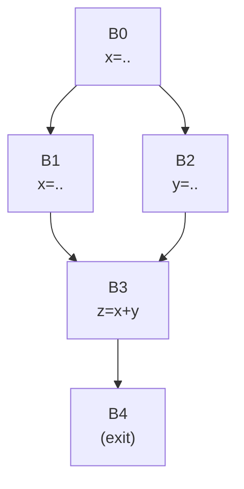

### Multiple Choice Options

The dominance frontier `DF(B1)` is:

* A) `{B3, B4}`
* B) `{B2, B3}`
* C) `{B4}`
* D) `{B3}`
* E) `{B1, B3}`
* F) `∅` (empty set)
* G) `{B0, B3}`
* H) `{B2, B3, B4}`

### Answer

**D) `{B3}`**

### Detailed Explanation

**Definition of Dominance Frontier:**
> `DF(X) = {Y | X dominates a predecessor of Y, but X does not strictly dominate Y}`

**Step 1: Compute Dominators**
- `dom(B0) = {B0}`
- `dom(B1) = {B0, B1}`
- `dom(B2) = {B0, B2}`
- `dom(B3) = {B0, B3}` (both B1 and B2 can reach B3)
- `dom(B4) = {B0, B3, B4}`

**Step 2: Check Each Node for DF(B1)**

For `B3`:
- Predecessors of `B3` are `{B1, B2}`
- Does `B1` dominate predecessor `B1`? **Yes** (a node dominates itself)
- Does `B1` strictly dominate `B3`? **No** (path `B0→B2→B3` exists)
- Therefore, `B3 ∈ DF(B1)` ✓

For `B4`:
- Predecessors of `B4` are `{B3}`
- Does `B1` dominate predecessor `B3`? **No** (path `B0→B2→B3` exists)
- Therefore, `B4 ∉ DF(B1)` ✗

**Conclusion:** `DF(B1) = {B3}`

**Why Other Options Are Wrong:**
- **A:** `B4` is not in `DF(B1)` because `B1` doesn't dominate `B3` (the only predecessor of `B4`)
- **B:** `B2` is not in `DF(B1)` because `B1` doesn't dominate any predecessor of `B2`
- **C:** `B4` alone is incorrect (see A)
- **E:** `B1` cannot be in its own dominance frontier in this acyclic CFG
- **F:** Empty set is wrong; `B3` clearly belongs
- **G:** `B0` dominates `B1`, not vice versa
- **H:** Both `B2` and `B4` don't meet the criteria

---

## Question 2: Iterated Dominance Frontier and φ-Placement

### Problem Statement

How many φ-functions for variable `x` are needed in minimal SSA form?

### Graph Representations

#### Shorthand Notation
```
B0 -> B1,B2
B1(x=1) -> B3
B2(x=2) -> B3
B3(y=x) -> B4,B5
B4(x=3) -> B6
B5(if(..)) -> B3
B6(w=x) -> exit
```

#### ASCII Diagram
```
           ┌─────┐
           │ B0  │
           └──┬──┘
              │
         ┌────┴───┐
         │        │
      ┌──▼──┐  ┌──▼──┐
      │ B1  │  │ B2  │
      │x=1  │  │x=2  │
      └──┬──┘  └──┬──┘
         │        │
         └────┬───┘
              │
           ┌──▼──┐
           │ B3  │◄───┐
           │y=x  │    │
           └──┬──┘    │
              │       │
         ┌────┴────┐  │
         │         │  │
      ┌──▼──┐  ┌──▼───┴┐
      │ B4  │  │  B5   │
      │x=3  │  │if(...)│
      └──┬──┘  └───────┘
         │
         │    ┌─────┐
         └───►│ B6  │
              │w=x  │
              └─────┘
```

#### Mermaid Diagram
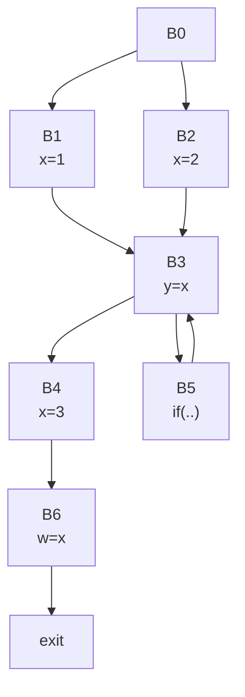

### Multiple Choice Options

* A) 2 φ-functions at `B3` and `B6`
* B) 3 φ-functions at `B3`, `B6`, and `B5`
* C) 1 φ-function at `B3`
* D) 2 φ-functions at `B3` (placed twice due to iteration)
* E) 3 φ-functions at `B3`, `B5`, and `B6`
* F) 4 φ-functions at `B3`, `B5`, `B6`, and one more at `B3` (iteration effect)
* G) 1 φ-function at `B6` only
* H) 0 φ-functions (reaching definitions analysis suffices)

### Answer

**C) 1 φ-function at `B3`**

### Detailed Explanation

**Step 1: Identify Definitions**
- `x` is defined at: `{B1, B2, B4}`

**Step 2: Compute Dominators**
- `dom(B3) = {B0, B3}` (both `B1` and `B2` can reach it)
- `dom(B4) = {B0, B3, B4}`
- `dom(B5) = {B0, B3, B5}`
- `dom(B6) = {B0, B3, B4, B6}`

**Step 3: Compute Dominance Frontiers**
- `DF(B1) = {B3}`: `B1` dominates itself (predecessor of `B3`) but not `B3`
- `DF(B2) = {B3}`: `B2` dominates itself (predecessor of `B3`) but not `B3`
- `DF(B4) = ∅`: `B4` strictly dominates `B6` (its only successor)

**Step 4: Compute Iterated Dominance Frontier**
- `DF⁺({B1, B2, B4}) = DF(B1) ∪ DF(B2) ∪ DF(B4) = {B3} ∪ {B3} ∪ ∅ = {B3}`

**Step 5: φ-Placement**
- Place φ-function at `B3`: `x₃ = φ(x₁, x₂, x₃)`
- Note: `B3` has three predecessors (`B1`, `B2`, `B5`), so the φ has three arguments
- The third argument comes from the loop backedge (`B5` passes through the current `x₃`)

**Why B6 Doesn't Need φ:**
- `B6` has only one predecessor (`B4`)
- Single predecessor means no merge point, no φ needed
- `B4` strictly dominates `B6`

**Why Other Options Are Wrong:**
- **A, B, E, F:** `B6` doesn't need φ (single predecessor)
- **B, E, F:** `B5` doesn't define `x`, so no φ needed
- **D:** You never place multiple φ-functions for the same variable at the same block
- **G:** Missing the essential join at `B3`
- **H:** SSA requires φ-functions at merge points

---

## Question 3: Post-Dominator Tree and Control Dependence

### Problem Statement

Which node is `B2` control-dependent on?

### Graph Representations

#### Shorthand Notation
```
B0 -> B1
B1(if(p)) -> B2, B3
B2 -> B4
B3 -> exit
B4 -> exit
```

#### ASCII Diagram
```
           ┌─────┐
           │ B0  │
           └──┬──┘
              │
           ┌──▼──┐
           │ B1  │
           │if(p)│
           └──┬──┘
              │
         ┌────┴───┐
         │        │
      ┌──▼──┐  ┌──▼──┐
      │ B2  │  │ B3  │
      │ ... │  │exit │
      └──┬──┘  └─────┘
         │
      ┌──▼──┐
      │ B4  │
      │exit │
      └─────┘
```

#### Mermaid Diagram
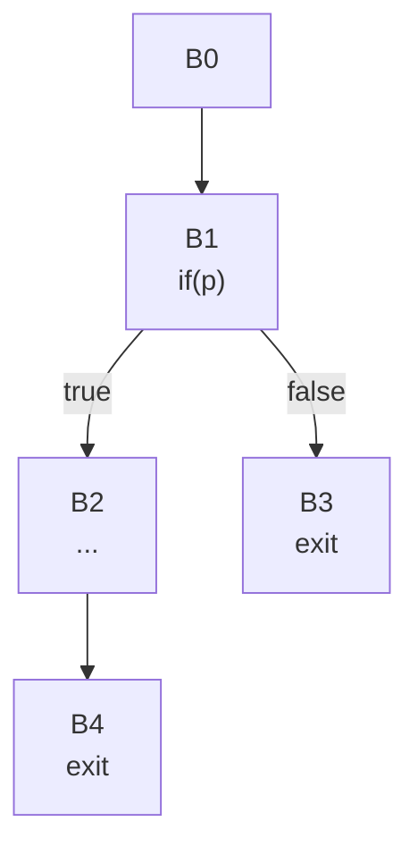

### Multiple Choice Options

* A) `B0`
* B) `B1`
* C) `B4`
* D) `B2` is not control-dependent on any node
* E) `B0` and `B1` (both)
* F) `B1` and `B2` (`B2` depends on itself)
* G) All nodes in the CFG
* H) `B3` (the alternate exit path)

### Answer

**B) `B1`**

### Detailed Explanation

**Definition of Control Dependence:**
> Node `Y` is control-dependent on node `X` iff:
> 1. There exists a path `X ⇒ ... ⇒ Y` on which `Y` post-dominates every node after `X`, AND
> 2. `Y` does NOT post-dominate `X`

**Step 1: Compute Post-Dominators**
- `postdom(B0) = {B0}` (assuming unified exit)
- `postdom(B1) = {B1}` (both paths lead to exit)
- `postdom(B2) = {B2, B4}` (must go through B4 to exit)
- `postdom(B3) = {B3}` (direct exit)
- `postdom(B4) = {B4}` (direct exit)

**Step 2: Check Control Dependence on B1**
- Path `B1 → B2 → B4`: Does `B2` post-dominate all nodes after `B1` on this path?
  - `B2` is on the path, and it post-dominates itself ✓
- Does `B2` post-dominate `B1`?
  - No! Path `B1 → B3` exists that bypasses `B2` ✗
- Therefore, `B2` is control-dependent on `B1` ✓

**Intuition:**
- `B1`'s decision (`if(p)`) determines whether `B2` executes
- If `p` is true, `B2` runs; if false, `B2` is skipped
- This is the essence of control dependence

**Why Other Options Are Wrong:**
- **A:** `B0` doesn't make a control decision affecting `B2`
- **C:** `B4` doesn't control `B2`; `B2` leads to `B4`
- **D:** `B2` clearly depends on `B1`'s branch
- **E:** `B0` doesn't introduce control dependence
- **F:** Nodes don't depend on themselves by standard definition
- **G:** Control dependence is specific, not universal
- **H:** `B3` is an alternate path but doesn't control `B2`

---

## Question 4: Loop Invariant Code Motion with Exceptions

### Problem Statement

Expression `t = a/b` is loop-invariant (`a`, `b` not modified in loop). Under which condition is hoisting `t = a/b` before `B1` ILLEGAL?

### Graph Representations

#### Shorthand Notation
```
B0 -> B1
B1(if(i<n)) -> B2, exit
B2(t=a/b, c[i]=t, i++) -> B1
```

#### ASCII Diagram
```
           ┌─────┐
           │ B0  │
           └──┬──┘
              │
       ┌──────▼──────┐
       │     B1      │◄────┐
       │  if(i<n)    │     │
       └──┬─────┬────┘     │
          │     │          │
       exit  ┌──▼───┐      │
             │ B2   │      │
             │ t=a/b│      │ (may throw div-by-zero)
             │c[i]=t│      │
             │  i++ │      │
             └──┬───┘      │
                └──────────┘
```

#### Mermaid Diagram
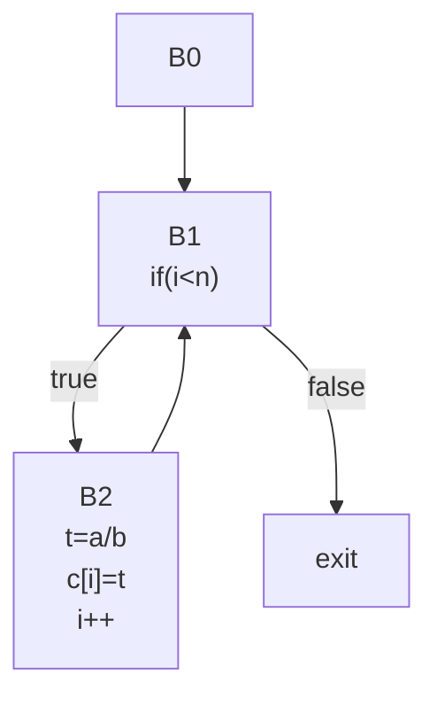

### Multiple Choice Options

* A) When `b` might be zero
* B) When the loop might execute zero iterations (`n ≤ 0`)
* C) When division has side effects (sets CPU flags)
* D) When `a` and `b` are floating-point with NaN handling
* E) B only (must not introduce new exceptions)
* F) A and B together
* G) B, C, and D together
* H) Never illegal - hoisting loop-invariant code is always safe

### Answer

**E) B only (must not introduce new exceptions)**

### Detailed Explanation

**Core Principle:**
> An optimization is ILLEGAL if it introduces a NEW exception on a path that would not have thrown an exception in the original code.

**Analysis:**

**Original Code Behavior:**
- If `i < n` is false initially (zero iterations), the division `t = a/b` NEVER executes
- If `i < n` is true, the loop runs and division executes

**After Hoisting:**
- The division `t = a/b` ALWAYS executes before the loop test
- Even if the loop runs zero times, division still happens

**Case Analysis:**

**Case 1: Loop runs, b = 0**
- Original: Division executes → exception thrown ✗
- Hoisted: Division executes → exception thrown ✗
- Result: Both throw → No NEW exception → Legal ✓

**Case 2: Loop doesn't run (n ≤ 0), b = 0**
- Original: Loop skipped, division never executes → no exception ✓
- Hoisted: Division executes before test → exception thrown ✗
- Result: NEW exception introduced → ILLEGAL ✗

**Case 3: Loop doesn't run (n ≤ 0), b ≠ 0**
- Original: Loop skipped, division never executes → no exception ✓
- Hoisted: Division executes → computes value (unused) → no exception ✓
- Result: No exception in either → Legal ✓ (but semantically questionable)

**Why B Only Is Sufficient:**

The zero-iteration scenario is the ONLY case where hoisting introduces a new exception. When the loop might not run, you cannot safely move a potentially-throwing operation outside the loop, regardless of whether `b` is zero or not.

**Why Other Options Are Wrong:**
- **A alone:** If loop always runs and `b=0`, BOTH versions throw → no new exception
- **F:** `A` is redundant; `B` alone captures the illegality
- **C:** CPU flags are typically not considered observable side effects
- **D:** NaN propagates in both versions; no new exception
- **G:** C and D don't contribute to illegality
- **H:** Exception semantics clearly matter

**Key Takeaway:**
Zero-trip loops are the critical case for exception-safety in LICM. Always ask: "Could this code path avoid the exception in the original but not in the optimized version?"

---

## Question 5: Dominance Frontier and φ-Placement

### Problem Statement

Where must φ-functions for variable `x` be placed?

### Graph Representations

#### Shorthand Notation
```
B0(x=1) -> B1
B1(if(p)) -> B2, B3
B2(x=2) -> B4
B3(y=..) -> B4
B4(z=x)
```

#### ASCII Diagram
```
           ┌─────┐
           │ B0  │  (entry)
           │x=1  │
           └──┬──┘
              │
           ┌──▼──┐
           │ B1  │
           │if(p)│
           └──┬──┘
              │
         ┌────┴───┐
         │        │
      ┌──▼──┐  ┌──▼──┐
      │ B2  │  │ B3  │
      │x=2  │  │y=.. │
      └──┬──┘  └──┬──┘
         │        │
         └────┬───┘
              │
           ┌──▼──┐
           │ B4  │
           │z=x  │
           └─────┘
```

#### Mermaid Diagram
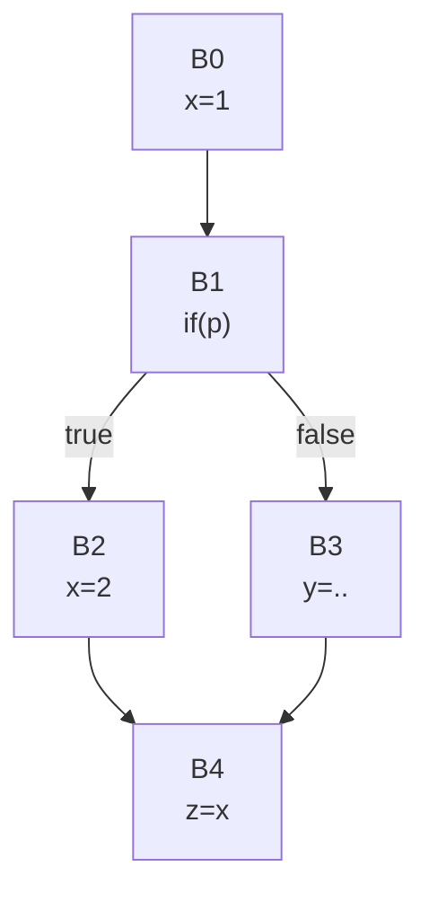

### Multiple Choice Options

* A) `B1` only (decision point)
* B) `B1` and `B4` (both join points)
* C) `B2` and `B3` (definition sites)
* D) No φ needed (`B0` dominates all)
* E) `B0` and `B4` (entry and exit)
* F) All blocks need φ-functions
* G) `B4` only (join point after definitions)
* H) `B3` and `B4` (`B3` needs φ even without defining `x`)

### Answer

**G) `B4` only (join point after definitions)**

### Detailed Explanation

**Step 1: Identify Definitions**
- `x` is defined at: `{B0, B2}`

**Step 2: Compute Dominance**
- `dom(B0) = {B0}`
- `dom(B1) = {B0, B1}`
- `dom(B2) = {B0, B1, B2}`
- `dom(B3) = {B0, B1, B3}`
- `dom(B4) = {B0, B1, B4}` (both `B2` and `B3` can reach it)

**Step 3: Compute Dominance Frontiers**

For `B0`:
- `B0` dominates all nodes
- `DF(B0) = ∅` (no node where `B0` dominates a predecessor but not the node itself)

For `B2`:
- Predecessors of `B4` are `{B2, B3}`
- Does `B2` dominate predecessor `B2` of `B4`? Yes ✓
- Does `B2` strictly dominate `B4`? No (path `B0→B1→B3→B4` bypasses `B2`) ✗
- Therefore `DF(B2) = {B4}`

**Step 4: Iterated Dominance Frontier**
- `DF⁺({B0, B2}) = DF(B0) ∪ DF(B2) = ∅ ∪ {B4} = {B4}`

**Step 5: φ-Placement**
- Place φ at `B4`: `x₄ = φ(x₂, x₀)`
- The φ merges:
  - From `B2`: `x₂` (redefined value)
  - From `B3`: `x₀` (original value from `B0`, passed through)

**SSA Form:**
```
B0: x₀ = 1
B1: if(p) ...
B2: x₂ = 2
B3: y = ...
B4: x₄ = φ(B2: x₂, B3: x₀)
    z = x₄
```

**Why Other Options Are Wrong:**
- **A, B:** `B1` is not a join point for `x` definitions (no φ needed)
- **C:** We place φ at JOIN points, not definition sites
- **D:** Even though `B0` defines `x`, `B2` redefines it, creating multiple reaching definitions
- **E:** `B0` is entry, doesn't need φ
- **F:** Only merge points with multiple reaching definitions need φ
- **H:** `B3` doesn't need φ (passes through `x₀`, doesn't merge definitions)

---

## Question 6: Strength Reduction in Loops

### Problem Statement

What is the CORRECT strength-reduced form with auxiliary induction variables?

### Original Code
```c
// Original loop
for (int i = 0; i < n; i++) {
    a[i * 4] = i * 4 + 10;
    b[i * 4] = i * 8;
}
```

### After Strength Reduction Template
```c
int t1 = 0, t2 = 10;
for (int i = 0; i < n; i++) {
    a[???] = ??? + 10
    b[???] = ???
}
```

### Multiple Choice Options

* A) `t1=0; t2=0; ... a[t1]=t1+10; b[t2]=t2; ... t1+=4; t2+=8;`
* B) `t1=0; t2=0; ... a[t1]=t2+10; b[t1]=t2; ... t1+=4; t2+=8;`
* C) `t=0; ... a[t]=t+10; b[t]=t*2; ... t+=4;`
* D) `t1=0; t2=0; ... a[t1]=t1+10; b[t1]=t2; ... t1+=4; t2+=4;`
* E) `t1=0; t2=10; ... a[t1]=t2; b[t1]=t1*2; ... t1+=4; t2+=4;`
* F) Cannot apply strength reduction (multiplications are necessary)
* G) `t=0; ... a[t]=t+10; b[t]=t+t; ... t+=4;`
* H) `t1=0; t2=0; t3=10; ... a[t1]=t3; b[t1]=t2; ... t1+=4; t2+=8; t3+=4;`

### Answer

**H) `t1=0; t2=0; t3=10; ... a[t1]=t3; b[t1]=t2; ... t1+=4; t2+=8; t3+=4;`**

### Detailed Explanation

**Step 1: Identify Induction Variables**

Basic IV: `i` (loop counter, `i++` means increment by 1)

Dependent IVs (expressions that are linear functions of `i`):
1. `i * 4` (for array indexing in both statements)
2. `i * 8` (RHS of `b[i*4] = ...`)
3. `i * 4 + 10` (RHS of `a[i*4] = ...`)

**Step 2: Create Auxiliary Variables**

For each dependent IV, create an auxiliary variable that:
- Initializes to the value when `i=0`
- Updates by adding the stride each iteration

**For `i * 4` (array indexing):**
- Auxiliary: `t1`
- Initial: `t1 = 0 * 4 = 0`
- Update: `t1 += 4` (since `i` increments by 1, `i*4` increments by 4)

**For `i * 8`:**
- Auxiliary: `t2`
- Initial: `t2 = 0 * 8 = 0`
- Update: `t2 += 8`

**For `i * 4 + 10`:**
- Auxiliary: `t3`
- Initial: `t3 = 0 * 4 + 10 = 10`
- Update: `t3 += 4` (the constant `+10` doesn't change)

**Step 3: Transformed Code**
```c
t1 = 0;      // tracks i * 4 (for array indexing)
t2 = 0;      // tracks i * 8
t3 = 10;     // tracks i * 4 + 10

for (i = 0; i < n; i++) {
    a[t1] = t3;
    b[t1] = t2;
    
    t1 += 4;
    t2 += 8;
    t3 += 4;
}
```

**Step 4: Verification**

Iteration `i=0`:
- `t1=0, t2=0, t3=10`
- `a[0] = 10` ✓ (original: `a[0*4] = 0*4+10 = 10`)
- `b[0] = 0` ✓ (original: `b[0*4] = 0*8 = 0`)

Iteration `i=1`:
- `t1=4, t2=8, t3=14`
- `a[4] = 14` ✓ (original: `a[1*4] = 1*4+10 = 14`)
- `b[4] = 8` ✓ (original: `b[1*4] = 1*8 = 8`)

Iteration `i=2`:
- `t1=8, t2=16, t3=18`
- `a[8] = 18` ✓ (original: `a[2*4] = 2*4+10 = 18`)
- `b[8] = 16` ✓ (original: `b[2*4] = 2*8 = 16`)

**Benefits:**
- Eliminates 6 multiplications per iteration (3 in original code)
- Replaces with 3 additions per iteration
- Multiplications are typically 3-10× slower than additions

**Costs:**
- 3 additional live variables (`t1`, `t2`, `t3`)
- Increased register pressure
- May not be profitable if it causes register spilling

**Why Other Options Are Wrong:**

- **A:** While `a[t1]=t1+10` is valid, using `t3` to pre-compute `i*4+10` is more optimized
- **B:** `a[t1]=t2+10` uses wrong variable (`t2` tracks `i*8`, not `i*4`)
- **C:** `t*2` still has multiplication; needs separate tracking
- **D:** `t2+=4` is WRONG; `t2` should track `i*8`, so increment by 8
- **E:** `t1*2` defeats purpose (multiplication still in loop)
- **F:** Strength reduction is definitely applicable
- **G:** Doesn't properly track all three distinct expressions

---

## Question 7: Strength Reduction Profitability

### Problem Statement

Under which condition is strength reduction UNPROFITABLE?

### Original Code
```c
// Loop with address calculation
for (i = 0; i < 100; i++) {
    sum += array[i * stride];
}
```

### Architecture Characteristics
- Integer multiplication: 3 cycles latency, 1/cycle throughput
- Integer addition: 1 cycle latency, 2/cycle throughput
- 16 general-purpose registers available
- Current register pressure: 14 registers in use

### After Strength Reduction
```c
p = &array[0];
for (i = 0; i < 100; i++) {
    sum += *p;
    p += stride;
}
```

### Multiple Choice Options

* A) `stride = 1` (unit stride)
* B) `stride = 1024` (large stride)
* C) The loop body is very large (50+ instructions)
* D) When the extra live variable `p` causes register spilling
* E) When `stride` is not a compile-time constant
* F) Never unprofitable - strength reduction always improves performance
* G) When the loop has only 2 iterations (`n=2`)
* H) When multiplication has 1-cycle latency

### Answer

**D) When the extra live variable `p` causes register spilling**

### Detailed Explanation

**Cost-Benefit Analysis:**

**Benefits:**
- Eliminates multiplication per iteration: ~2-3 cycles saved
- 100 iterations × 2.5 cycles = ~250 cycles saved

**Costs:**
- Introduces one new live variable (`p`)
- Current: 14 registers used
- After: 15 registers used
- If total live variables exceed 16 → spilling occurs

**Spilling Cost:**
- Store to memory: ~5 cycles
- Load from memory: ~5 cycles
- Per iteration overhead: can be 10+ cycles
- 100 iterations × 10 cycles = 1000+ cycles COST

**When Spilling Occurs:**
If adding `p` pushes the register allocator over the limit:
- Net result: -750 cycles (1000 cost - 250 benefit)
- Optimization becomes UNPROFITABLE

**Why Other Options Are Wrong:**

**A) `stride = 1` (unit stride):**
- Still beneficial: pointer increment is cheaper than multiplication
- Many architectures have auto-increment addressing modes
- NOT unprofitable

**B) `stride = 1024` (large stride):**
- Large constant doesn't affect the arithmetic cost
- Addition with large constant still cheaper than multiplication
- NOT unprofitable

**C) Loop body is very large:**
- Large loop body doesn't change the per-iteration arithmetic cost
- Might even make strength reduction MORE profitable (amortized over more work)
- NOT unprofitable

**E) `stride` not compile-time constant:**
- Runtime value can still be used: `p += stride` works fine
- Variable stride doesn't prevent strength reduction
- NOT unprofitable

**F) Never unprofitable:**
- FALSE - register spilling can make it unprofitable

**G) Only 2 iterations:**
- Small iteration count reduces total benefit (2 × 2.5 = 5 cycles)
- But doesn't make it unprofitable unless overhead exceeds 5 cycles
- Spilling is worse

**H) Multiplication has 1-cycle latency:**
- Would reduce benefit to near zero
- But still wouldn't be unprofitable (no harm)
- Spilling actively COSTS performance

**Key Insight:**
Strength reduction trades **computation for storage**. It's only profitable when:
1. The storage cost (register pressure) doesn't exceed available resources
2. The computational savings outweigh any memory access overhead from spilling

---

## Question 8: Loop Invariant Code Motion vs. Strength Reduction

### Problem Statement

Which optimization applies to which expression?

### Original Code
```c
for (i = 0; i < n; i++) {
    a[i] = b[i] * factor + offset;
}
```

Note: `factor` and `offset` are loop-invariant (not modified in loop)

### Multiple Choice Options

* A) Strength reduction: `i`; LICM: `factor`, `offset` (but not `b[i] * factor`)
* B) Strength reduction: `i`; LICM: `factor`, `offset`, `b[i] * factor`
* C) Strength reduction: `i`, `b[i]`; LICM: `offset`
* D) Strength reduction: none; LICM: `factor`, `offset`
* E) Strength reduction: `i`, `b[i] * factor`, `offset`; LICM: none
* F) Strength reduction: `i`, `b[i]`, `b[i] * factor`; LICM: `factor + offset`
* G) Strength reduction: `i`, `b[i] * factor`; LICM: `offset`
* H) Both optimizations apply to all expressions

### Answer

**A) Strength reduction: `i`; LICM: `factor`, `offset` (but not `b[i] * factor`)**

### Detailed Explanation

**Understanding the Optimizations:**

**Strength Reduction:**
- Replaces expensive operations with cheaper ones
- Based on induction variable relationships
- Applies to expressions that are linear functions of the loop counter

**Loop Invariant Code Motion (LICM):**
- Hoists computations that don't change across iterations
- Applies to expressions that have the same value every iteration

**Analysis of Each Expression:**

**1. `i` (loop counter):**
- **Strength Reduction: YES**
- Array indexing can use pointer arithmetic
- Instead of computing `&a[i]` and `&b[i]` each iteration, increment pointers
- Transform: `pa++` and `pb++` instead of `&a[i]` and `&b[i]`

**2. `factor` (scalar variable):**
- **LICM: YES** (already invariant, just a load)
- **Strength Reduction: NO** (not dependent on induction variable)
- Already optimal as a single variable reference

**3. `offset` (scalar variable):**
- **LICM: YES** (already invariant, just a load)
- **Strength Reduction: NO** (not dependent on induction variable)
- Already optimal as a single variable reference

**4. `b[i]` (array access):**
- **LICM: NO** (depends on `i`, changes each iteration)
- **Strength Reduction: YES** (indirectly, via pointer to `b`)
- The indexing operation benefits from strength reduction on `i`

**5. `b[i] * factor` (multiplication):**
- **LICM: NO** (`b[i]` changes each iteration, so the product changes)
- **Strength Reduction: NO** (not a linear function of `i` alone)
- Cannot be optimized to addition without knowing relationship between `b[i]` and `i`

**Transformed Code:**

```c
// After both optimizations
pa = &a[0];
pb = &b[0];
// factor and offset already available (LICM implicit)

for (i = 0; i < n; i++) {
    *pa = *pb * factor + offset;
    pa++;  // strength reduction for a[i]
    pb++;  // strength reduction for b[i]
}
```

**Why Other Options Are Wrong:**

- **B:** `b[i] * factor` is NOT loop-invariant (depends on `i` through `b[i]`)
- **C:** `b[i]` alone doesn't get strength reduction; the indexing does
- **D:** Strength reduction DOES apply to array indexing via `i`
- **E, G:** `b[i] * factor` cannot be strength reduced (not linear in `i`)
- **F:** Cannot hoist `factor + offset` as a combined value (need individual values)
- **H:** Not all expressions benefit from both optimizations

**Key Distinction:**
- **Strength Reduction:** Optimizes operations involving **induction variables** (loop counters)
- **LICM:** Optimizes expressions that are **constant** across loop iterations

---

## Question 9: Horner's Rule for Polynomial Evaluation

### Problem Statement

How many multiplications does each form require?

### Polynomial
Evaluate: `2x³ + 3x² + 4x + 5`

### Form A (Naive Evaluation)
```c
result = 2*x*x*x + 3*x*x + 4*x + 5;
```

### Form B (Horner's Rule)
```c
result = ((2*x + 3)*x + 4)*x + 5;
```

### Multiple Choice Options

* A) Form A: 6 muls; Form B: 3 muls
* B) Form A: 4 muls; Form B: 3 muls
* C) Form A: 3 muls; Form B: 3 muls (equal)
* D) Form A: 6 muls; Form B: 4 muls
* E) Form A: 5 muls; Form B: 3 muls
* F) Form A: 7 muls; Form B: 3 muls
* G) Form A: 3 muls; Form B: 2 muls
* H) Depends on compiler optimization level

### Answer

**A) Form A: 6 muls; Form B: 3 muls**

### Detailed Explanation

**Assumption:** Counting multiplications for **naive evaluation** without common subexpression elimination (CSE). Each power is computed independently.

**Form A: Naive Evaluation**

Breaking down `2*x*x*x + 3*x*x + 4*x + 5`:

Term 1: `2*x*x*x`
- `2 * x` → 1 multiplication
- `(2*x) * x` → 1 multiplication
- `((2*x)*x) * x` → 1 multiplication
- Subtotal: 3 multiplications

Term 2: `3*x*x`
- `3 * x` → 1 multiplication
- `(3*x) * x` → 1 multiplication
- Subtotal: 2 multiplications

Term 3: `4*x`
- `4 * x` → 1 multiplication
- Subtotal: 1 multiplication

Term 4: `5`
- No multiplication

**Total: 3 + 2 + 1 = 6 multiplications**

**Form B: Horner's Rule**

Breaking down `((2*x + 3)*x + 4)*x + 5`:

Step 1: `2*x`
- 1 multiplication

Step 2: `(2*x + 3)*x`
- Add 3 to result (no multiplication)
- Multiply by x → 1 multiplication

Step 3: `((2*x+3)*x + 4)*x`
- Add 4 to result (no multiplication)
- Multiply by x → 1 multiplication

Step 4: `(((2*x+3)*x+4)*x + 5)`
- Add 5 to result (no multiplication)

**Total: 1 + 1 + 1 = 3 multiplications**

**Horner's Rule Algorithm:**

For polynomial `aₙxⁿ + aₙ₋₁xⁿ⁻¹ + ... + a₁x + a₀`:

```
result = aₙ
for i from n-1 down to 0:
    result = result * x + aᵢ
```

Each iteration: 1 multiplication + 1 addition
Total multiplications: n (where n is degree)

**Benefits:**
1. **Fewer multiplications:** `O(n)` instead of `O(n²)`
2. **Better numerical stability** (for floating-point)
3. **Sequential dependencies** (easier for pipelining)

**Comparison Table:**

| Degree | Naive | Horner's | Savings |
|--------|-------|----------|---------|
| 1      | 1     | 1        | 0       |
| 2      | 3     | 2        | 1       |
| 3      | 6     | 3        | 3       |
| 4      | 10    | 4        | 6       |
| 5      | 15    | 5        | 10      |
| 10     | 55    | 10       | 45      |

**Why Other Options Are Wrong:**
- **B-G:** Incorrect counting of multiplications
- **H:** The multiplication count is algorithmic, not dependent on optimization level (unless CSE is applied, which changes the algorithm)

**Note on CSE:**
With common subexpression elimination, naive form could be improved:
```c
temp1 = x * x;           // 1 mul
temp2 = temp1 * x;       // 1 mul (x³)
result = 2*temp2 + 3*temp1 + 4*x + 5;  // 3 muls
// Total: 4 muls
```
But Horner's rule is still better!

---

## Question 10: SSA-Based Constant Folding and Dead Code Elimination

### Problem Statement

After constant folding and dead code elimination, what code remains?

### Original SSA Code

#### Shorthand Notation
```
B0: x1=5, y1=10, if(x1<3) -> B1,B2
B1: z1=x1+y1, w1=z1*2 -> B3
B2: z2=x1-y1, w2=z2*3 -> B3
B3: z3=φ(z1,z2), w3=φ(w1,w2), result=z3+w3
```

#### Structured Form
```
.B0:
    x₁ = 5
    y₁ = 10
    if (x₁ < 3) goto B1 else goto B2

.B1:
    z₁ = x₁ + y₁
    w₁ = z₁ * 2
    goto B3

.B2:
    z₂ = x₁ - y₁
    w₂ = z₂ * 3
    goto B3

.B3:
    z₃ = φ(z₁, z₂)
    w₃ = φ(w₁, w₂)
    result = z₃ + w₃
```

#### Mermaid Diagram
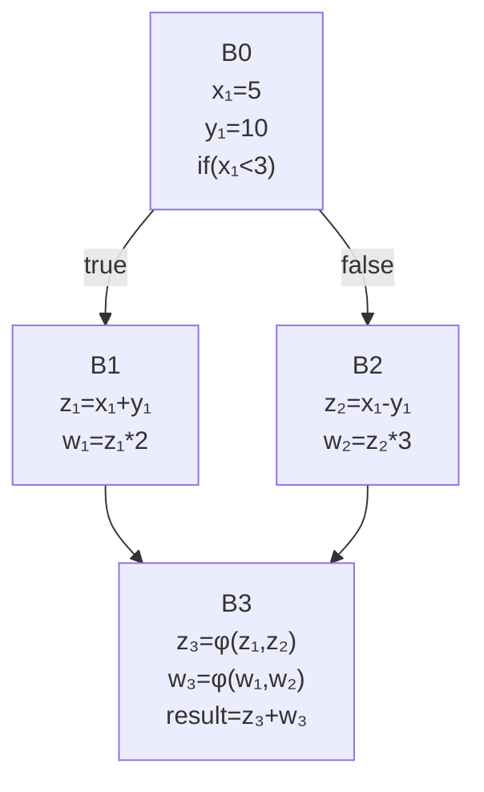

### Multiple Choice Options

* A) `B0: if(5<3) ...; B1: ...; B2: z₂=-5; w₂=-15; B3: result=-20`
* B) `B0: x₁=5; y₁=10; B2: z₂=-5; w₂=-15; B3: result=-20`
* C) `B0: x₁=5; y₁=10; B3: result=φ(-20, -20)`
* D) All blocks remain (cannot eliminate φ-functions)
* E) `B0: goto B2; B2: result=-20`
* F) `B0: result=-20`
* G) Only `B3` remains with result computation
* H) `B2: z₂=-5; w₂=-15; B3: result=-20`

### Answer

**F) `B0: result=-20`**

### Detailed Explanation

**Step 1: Constant Folding in B0**
- `x₁ = 5` (constant)
- `y₁ = 10` (constant)
- `if (5 < 3)` → evaluate to `FALSE` (constant condition)
- Control flow: Always take `B2`, never take `B1`

**Step 2: Mark Unreachable Code**
- `B1` is unreachable → mark for deletion
- All definitions in `B1` are dead

**Step 3: Constant Propagation to B2**
- `z₂ = x₁ - y₁ = 5 - 10 = -5`
- `w₂ = z₂ * 3 = -5 * 3 = -15`

**Step 4: Simplify B3 φ-Functions**
- `z₃ = φ(z₁, z₂)` but `B1` is unreachable
- `z₃ = φ(⊥, -5) = -5` (φ with one reachable predecessor)
- `w₃ = φ(w₁, w₂)` but `B1` is unreachable
- `w₃ = φ(⊥, -15) = -15`
- `result = z₃ + w₃ = -5 + (-15) = -20`

**Step 5: Dead Code Elimination**
- `B1`: unreachable → delete
- `B2`: all values only used in `B3` → inline and eliminate
- `B3`: φ-functions collapse, computation is constant → inline
- Final: Just the constant result

**Optimization Sequence:**

```
Original:
B0: x₁=5, y₁=10, if(x₁<3) -> B1,B2
B1: [unreachable]
B2: z₂=-5, w₂=-15
B3: z₃=-5, w₃=-15, result=-20

After constant propagation:
B0: if(false) -> B1,B2
B2: z₂=-5, w₂=-15
B3: result=-20

After branch elimination:
B0: goto B2
B2: z₂=-5, w₂=-15
B3: result=-20

After dead code elimination:
B0: result=-20
```

**Final Code:**
```
.B0:
    result = -20
```

**Why Other Options Are Wrong:**

- **A:** Retains unnecessary conditional and blocks
- **B:** Retains dead variable assignments (`x₁`, `y₁`, `z₂`, `w₂`)
- **C:** φ-functions should be eliminated when collapsed to constant
- **D:** φ-functions CAN be eliminated when they collapse
- **E:** Still has unnecessary goto and separate block
- **G:** `B3` can be merged into `B0`
- **H:** Retains intermediate blocks unnecessarily

**Key Techniques:**
1. **Constant Folding:** Evaluate constant expressions at compile time
2. **Constant Propagation:** Replace variables with their constant values
3. **Branch Elimination:** Remove branches with constant conditions
4. **φ-Function Simplification:** Collapse φ-functions with one reachable input
5. **Dead Code Elimination:** Remove unreachable and unused code

---

## Question 11: SSA-Based Value Range Propagation and DCE

### Problem Statement

After value range analysis proves `a₂` is always `≤ 14`, which code remains?

### Original SSA Code

#### Shorthand Notation
```
B0: a1=10, b1=20 -> B1
B1: a2=φ(a1,a3), if(a2>100) -> B2,B3
B2: c1=a2/2 -> B4
B3: a3=a2+1, if(a3<15) -> B1,B4
B4: a4=φ(a2,a3), c2=φ(c1,0), result=a4+c2
```

#### Structured Form
```
B0:
    a₁ = 10
    b₁ = 20
    goto B1

B1:
    a₂ = φ(a₁, a₃)
    if (a₂ > 100) goto B2 else goto B3

B2:
    c₁ = a₂ / 2
    goto B4

B3:
    a₃ = a₂ + 1
    if (a₃ < 15) goto B1 else goto B4

B4:
    a₄ = φ(a₂, a₃)
    c₂ = φ(c₁, 0)
    result = a₄ + c₂
```

#### Mermaid Diagram
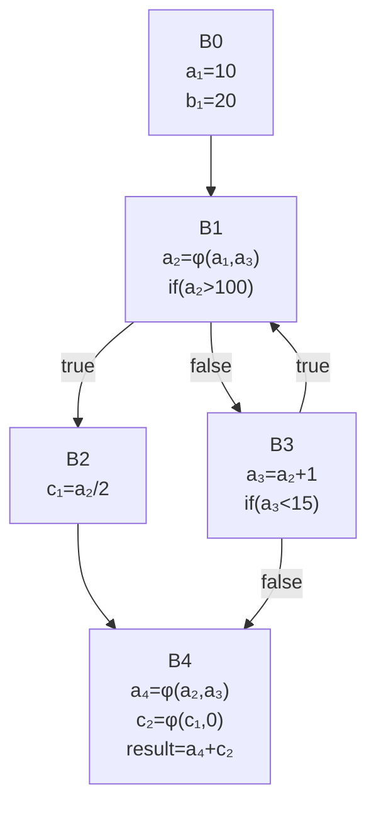

### Multiple Choice Options

* A) All blocks remain unchanged
* B) `B0-B1-B3-B4` remain; `B2` deleted; `c₂=0` in `B4`
* C) `B2` is eliminated; `B4: a₄=φ(⊥,a₃); c₂=0; result=a₄`
* D) Entire loop eliminated; `B0: result=14`
* E) `B2` eliminated; `B3`: produces values `11,12,13,14`
* F) `B0: a₁=10; B1-B3: loop executes; B4: result=a₄`
* G) Only `B4: result=14` remains
* H) Cannot eliminate `B2` (may be reachable)

### Answer

**B) `B0-B1-B3-B4` remain; `B2` deleted; `c₂=0` in `B4`**

### Detailed Explanation

**Step 1: Value Range Analysis**

Track the range of `a₂` through the loop:

- Initial: `a₁ = 10` → `a₂ = 10` (first iteration)
- Iteration 1: `a₃ = 10 + 1 = 11` → `a₂ = 11` (second iteration)
- Iteration 2: `a₃ = 11 + 1 = 12` → `a₂ = 12` (third iteration)
- Iteration 3: `a₃ = 12 + 1 = 13` → `a₂ = 13` (fourth iteration)
- Iteration 4: `a₃ = 13 + 1 = 14` → `a₂ = 14` (fifth iteration)
- Iteration 5: `a₃ = 14 + 1 = 15` → `if(15 < 15)` is FALSE → exit to B4

**Range of `a₂`: [10, 14]**

**Step 2: Branch Analysis**

`B1: if (a₂ > 100)`
- Since `a₂ ≤ 14`, the condition `a₂ > 100` is ALWAYS FALSE
- `B2` is never taken → unreachable

**Step 3: Dead Code Elimination**

- `B2` is unreachable → delete
- `c₁` is never defined → dead

**Step 4: Simplify B4 φ-Functions**

Original:
```
a₄ = φ(B2: a₂, B3: a₃)
c₂ = φ(B2: c₁, B3: 0)
```

After eliminating `B2`:
```
a₄ = φ(B3: a₃)  →  a₄ = a₃
c₂ = φ(B3: 0)   →  c₂ = 0
```

**Step 5: Remaining Code**

```
B0:
    a₁ = 10
    b₁ = 20
    goto B1

B1:
    a₂ = φ(a₁, a₃)
    // if (a₂ > 100) always false, goes to B3
    goto B3

B3:
    a₃ = a₂ + 1
    if (a₃ < 15) goto B1 else goto B4

B4:
    a₄ = a₃  // simplified φ
    c₂ = 0   // simplified φ
    result = a₄ + c₂ = a₄ + 0 = a₄
```

**Why We Can't Eliminate More:**

The loop must still execute to compute the final value:
- Loop runs from `a₂=10` to `a₂=14`
- Final value `a₄ = 14` (last value of `a₃`)
- Cannot be computed without running the loop

**Why Other Options Are Wrong:**

- **A:** `B2` is provably unreachable
- **C:** Notation is awkward; B is clearer
- **D:** Loop must execute to reach final value 14
- **E:** Too vague, doesn't specify complete structure
- **F:** Too vague
- **G:** Loop computation cannot be eliminated
- **H:** VRP proves `B2` is unreachable

**Key Insight:**
Value range propagation enables dead code elimination by proving branches are always/never taken. However, loops that compute final values (not just check conditions) cannot be eliminated entirely.

---

## Question 12: SSA Constant Propagation with CFG

### Problem Statement

After constant propagation and dead code elimination, which blocks remain?

### Graph Representations

#### Shorthand Notation
```
B0(x=7,y=3) -> B1
B1(if(x>5)) -> B2,B3
B2(z=x+y) -> B4
B3(z=x*2) -> B4
B4(w=φ(z,z), r=w-y)
```

#### ASCII Diagram
```
           ┌─────┐
           │ B0  │
           │x=7  │
           │y=3  │
           └──┬──┘
              │
           ┌──▼────┐
           │ B1    │
           │if(x>5)│
           └──┬────┘
              │
         ┌────┴────┐
         │         │
      ┌──▼──┐  ┌──▼──┐
      │ B2  │  │ B3  │
      │z=x+y│  │z=x*2│
      └──┬──┘  └──┬──┘
         │        │
         └────┬───┘
              │
           ┌──▼─────┐
           │ B4     │
           │w=φ(z,z)│
           │r=w-y   │
           └────────┘
```

#### Mermaid Diagram
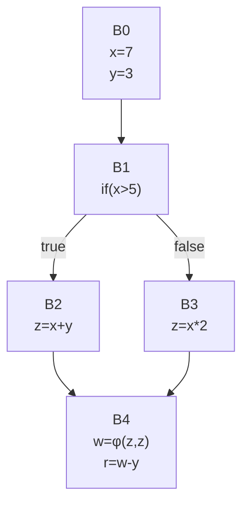

### Multiple Choice Options

* A) All blocks `B0-B4` remain
* B) `B0, B3, B4` remain (`B2` eliminated)
* C) Only `B0` remains with `r=7`
* D) `B0, B1, B2, B4` remain
* E) `B0, B2, B4` remain (`B3` eliminated)
* F) `B0, B4` remain (`B1-B3` eliminated)
* G) Only `B4` remains with `r=7`
* H) Cannot eliminate any blocks (φ-function prevents DCE)

### Answer

**E) `B0, B2, B4` remain (`B3` eliminated)**

### Detailed Explanation

**Step 1: Constant Propagation in B0**
- `x = 7` (constant)
- `y = 3` (constant)

**Step 2: Constant Folding in B1**
- `if (x > 5)` → `if (7 > 5)` → `TRUE`
- Branch always takes `B2`, never takes `B3`

**Step 3: Mark Unreachable Code**
- `B3` is unreachable → mark for deletion
- Definition `z = x*2` in `B3` is dead

**Step 4: Constant Propagation to B2**
- `z = x + y = 7 + 3 = 10`

**Step 5: Simplify B4**
- `w = φ(B2: z, B3: z)` but `B3` is unreachable
- `w = φ(10, ⊥) = 10`
- `r = w - y = 10 - 3 = 7`

**Step 6: Dead Code Elimination**
- `B3`: unreachable → delete
- `B1`: can be simplified (constant branch) but may remain for structure
- However, the question asks which blocks remain, and typically we keep control flow structure

**Optimization Sequence:**

```
After constant propagation:
B0: x=7, y=3
B1: if(true) -> B2, B3
B2: z=10
B3: [unreachable]
B4: w=10, r=7

After branch elimination:
B0: x=7, y=3
B2: z=10
B4: w=10, r=7
```

**Remaining Blocks:**
- `B0`: Constants defined
- `B2`: Computation (always executed)
- `B4`: Result computation

**Why Other Options Are Wrong:**

- **A:** `B1` and `B3` can be eliminated (constant branch, unreachable code)
- **B:** Wrong branch eliminated (should be `B3`, not `B2`)
- **C, F, G:** Over-aggressive elimination loses control flow structure
- **D:** `B1` can be eliminated with branch folding
- **H:** φ-functions simplify when one predecessor is unreachable

**Key Insight:**
Constant branches enable elimination of unreachable paths. The remaining blocks form the simplified execution path.

---

## Question 13: SSA Constant Propagation with Nested Branches

### Problem Statement

After constant propagation, what is the value of `result` in `B6`?

### Graph Representations

#### Shorthand Notation
```
B0(a=4,b=6) -> B1
B1(if(a>5)) -> B2,B3
B2(c=a+b, if(c>8)) -> B4,B5
B3(c=a*b) -> B6
B4(d=10) -> B6
B5(d=20) -> B6
B6(d2=φ(B4:d,B5:d,B3:⊥), result=d2+c)
```

#### ASCII Diagram
```
           ┌─────┐
           │ B0  │
           │a=4  │
           │b=6  │
           └──┬──┘
              │
           ┌──▼────┐
           │ B1    │
           │if(a<5)│
           └──┬────┘
              │
         ┌────┴─────┐
         │          │
      ┌──▼────┐  ┌──▼──┐
      │ B2    │  │ B3  │
      │c=a+b  │  │c=a*b│
      │if(c>8)│  └──┬──┘
      └──┬────┘     │
         │          │
    ┌────┴───┐      │
    │        │      │
  ┌─▼──┐  ┌─▼──┐    │
  │ B4 │  │ B5 │    │
  │d=10│  │d=20│    │
  └─┬──┘  └─┬──┘    │
    │       │       │
    └───┬───┘       │
        │           │
 ┌──▼────────────┐  │
 │ B6            │◄─┘
 │d₂=φ(B4:d,B5:d,│
 │    B3:⊥)      │
 │result=d₂+c    │
 └───────────────┘
```

#### Mermaid Diagram
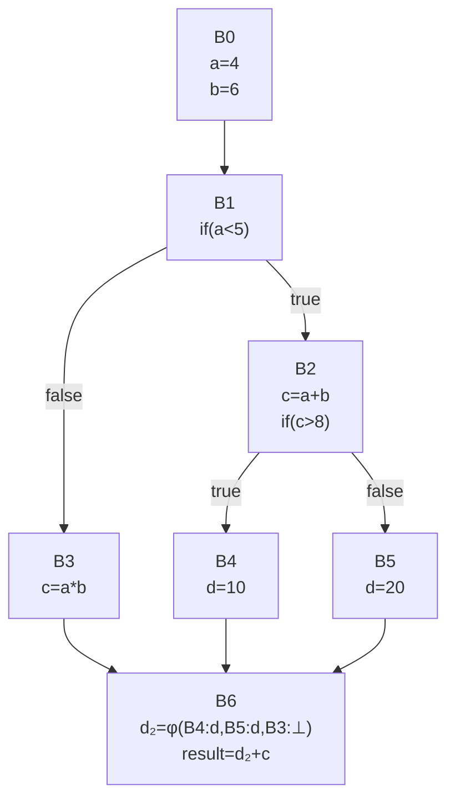

### Multiple Choice Options

* A) `result = 30`
* B) `result = 34`
* C) `result = 20`
* D) `result = 14`
* E) `result = ⊤` (overdefined)
* F) `result = 28`
* G) Cannot determine
* H) `result = 24`

### Answer

**C) `result = 20`**

### Detailed Explanation

**Step 1: Constant Propagation in B0**
- `a = 4` (constant)
- `b = 6` (constant)

**Step 2: Evaluate B1 Branch**
- `if (a < 5)` → `if (4 < 5)` → `TRUE`
- Branch takes `B2`, `B3` is unreachable

**Step 3: Constant Propagation to B2**
- `c = a + b = 4 + 6 = 10`
- `if (c > 8)` → `if (10 > 8)` → `TRUE`
- Branch takes `B4`, `B5` is unreachable

**Step 4: Constant Propagation to B4**
- `d = 10`

**Step 5: Simplify B6**
- Only `B4` reaches `B6` (both `B3` and `B5` are unreachable)
- `d₂ = φ(B4: 10, B5: ⊥, B3: ⊥) = 10`
- `c` in `B6` comes from `B2`: `c = 10`
- `result = d₂ + c = 10 + 10 = 20`

**Execution Trace:**
```
B0: a=4, b=6
  ↓
B1: if(4<5) → TRUE
  ↓
B2: c=10, if(10>8) → TRUE
  ↓
B4: d=10
  ↓
B6: d₂=10, c=10, result=20
```

**Why Other Options Are Wrong:**

- **A (30):** Would require `d=20` and `c=10`, but `B5` (where `d=20`) is unreachable
- **B (34):** Would require `c=24` from `B3` (where `c=a*b=24`), but `B3` is unreachable
- **D (14):** Incorrect calculation
- **E:** Not overdefined; the path is fully determinable
- **F (28):** Would need different values
- **G:** Fully determinable via constant propagation
- **H (24):** Would require `c=24` from `B3`, but that path is unreachable

**Key Insight:**
Nested branches with constant conditions eliminate multiple levels of unreachable code. Track which path is actually taken through the entire nested structure.

---

## Question 14: SSA Dead Code Elimination with CFG

### Problem Statement

After constant propagation and DCE, what remains at `B4`?

### Graph Representations

#### Shorthand Notation
```
B0(x=2,y=8) -> B1
B1(z=x*y, if(z>10)) -> B2,B3
B2(w=z-5) -> B4
B3(w=z+5) -> B4
B4(w2=φ(w1,w3), r=w2*2)
```

#### ASCII Diagram
```
           ┌─────┐
           │ B0  │
           │x=2  │
           │y=8  │
           └──┬──┘
              │
           ┌──▼─────┐
           │ B1     │
           │z=x*y   │
           │if(z>10)│
           └──┬─────┘
              │
         ┌────┴────┐
         │         │
      ┌──▼──┐  ┌──▼──┐
      │ B2  │  │ B3  │
      │w=z-5│  │w=z+5│
      └──┬──┘  └──┬──┘
         │        │
         └────┬───┘
              │
           ┌──▼────────┐
           │ B4        │
           │w₂=φ(w₁,w₃)│
           │r=w₂*2     │
           └───────────┘
```

#### Mermaid Diagram
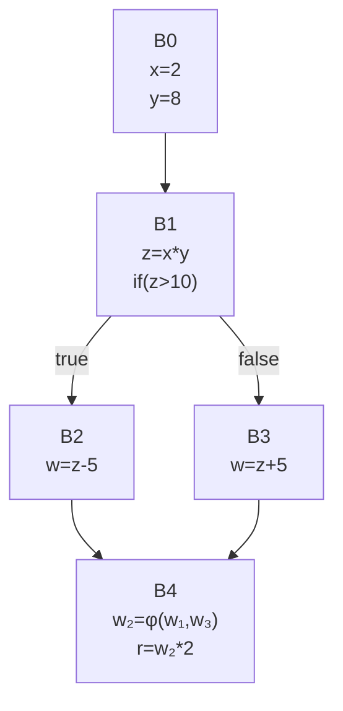

### Multiple Choice Options

* A) `w₂=φ(11,21); r=w₂*2`
* B) `w₂=11; r=22`
* C) `w₂=21; r=42`
* D) `r=42`
* E) All code remains unchanged
* F) `w₂=φ(11,11); r=22`
* G) `r=22`
* H) Cannot determine

### Answer

**G) `r=22`**

### Detailed Explanation

**Step 1: Constant Propagation in B0**
- `x = 2` (constant)
- `y = 8` (constant)

**Step 2: Constant Propagation in B1**
- `z = x * y = 2 * 8 = 16`
- `if (z > 10)` → `if (16 > 10)` → `TRUE`
- Branch takes `B2`, `B3` is unreachable

**Step 3: Constant Propagation to B2**
- `w = z - 5 = 16 - 5 = 11`

**Step 4: Simplify B4**
- `w₂ = φ(B2: 11, B3: ⊥) = 11` (B3 unreachable)
- `r = w₂ * 2 = 11 * 2 = 22`

**Step 5: Dead Code Elimination**
- `B3` is unreachable → delete
- `w₂` is only used to compute `r` → can be inlined
- Final simplified: `r = 22`

**Optimization Sequence:**

```
After constant propagation:
B0: x=2, y=8
B1: z=16, if(true) -> B2, B3
B2: w=11
B3: [unreachable]
B4: w₂=11, r=22

After DCE and simplification:
B0: (constants eliminated)
B1: (branch eliminated)
B2: (intermediate eliminated)
B4: r=22
```

**Why Other Options Are Wrong:**

- **A:** φ-function should be simplified (only one reachable predecessor)
- **B:** `w₂` can be eliminated since it's only used once
- **C:** Wrong path (B3 is unreachable)
- **D:** Wrong path (B3 would give `w=21`, but it's unreachable)
- **E:** DCE removes unreachable code and simplifies
- **F:** φ-function with single reachable input should be eliminated
- **H:** Fully determinable via constant propagation

**Key Insight:**
After constant propagation proves a branch is always taken, the unreachable path can be eliminated, and φ-functions collapse to single values that can be further simplified.

---

## Question 15: SSA Constant Folding with Multiple φ-Functions

### Problem Statement

After constant propagation, what is `result` at `B4`?

### Graph Representations

#### Shorthand Notation
```
B0(a=6,b=3) -> B1
B1(if(a>b)) -> B2,B3
B2(x=a-b, y=10) -> B4
B3(x=b-a, y=20) -> B4
B4(x2=φ(x1,x3), y2=φ(y1,y3), result=x2+y2)
```

#### ASCII Diagram
```
           ┌─────┐
           │ B0  │
           │a=6  │
           │b=3  │
           └──┬──┘
              │
           ┌──▼────┐
           │ B1    │
           │if(a>b)│
           └──┬────┘
              │
         ┌────┴────┐
         │         │
      ┌──▼──┐  ┌──▼──┐
      │ B2  │  │ B3  │
      │x=a-b│  │x=b-a│
      │y=10 │  │y=20 │
      └──┬──┘  └──┬──┘
         │        │
         └────┬───┘
              │
           ┌──▼─────────┐
           │ B4         │
           │x₂=φ(x₁,x₃) │
           │y₂=φ(y₁,y₃) │
           │result=x₂+y₂│
           └────────────┘
```

#### Mermaid Diagram
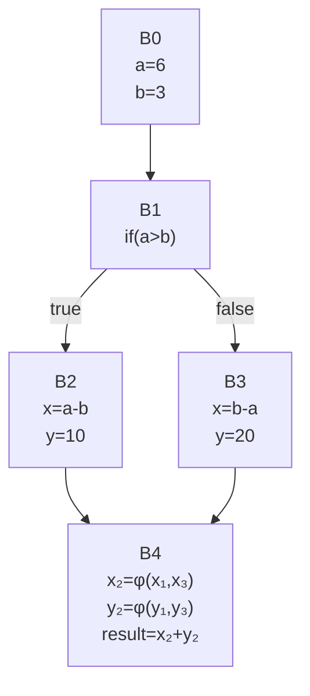

### Multiple Choice Options

* A) `result = 13`
* B) `result = 23`
* C) `result = 17`
* D) `result = -17`
* E) `result = ⊤` (overdefined)
* F) `result = 30`
* G) `result = 10`
* H) `result = 7`

### Answer

**A) `result = 13`**

### Detailed Explanation

**Step 1: Constant Propagation in B0**
- `a = 6` (constant)
- `b = 3` (constant)

**Step 2: Evaluate B1 Branch**
- `if (a > b)` → `if (6 > 3)` → `TRUE`
- Branch takes `B2`, `B3` is unreachable

**Step 3: Constant Propagation to B2**
- `x = a - b = 6 - 3 = 3`
- `y = 10`

**Step 4: Simplify B4**
- `x₂ = φ(B2: 3, B3: ⊥) = 3` (B3 unreachable)
- `y₂ = φ(B2: 10, B3: ⊥) = 10` (B3 unreachable)
- `result = x₂ + y₂ = 3 + 10 = 13`

**Execution Trace:**
```
B0: a=6, b=3
  ↓
B1: if(6>3) → TRUE
  ↓
B2: x=3, y=10
  ↓
B4: x₂=3, y₂=10, result=13
```

**Verification with Alternative Path (unreachable):**
If `B3` were reachable:
- `x = b - a = 3 - 6 = -3`
- `y = 20`
- `result = -3 + 20 = 17` (but this path doesn't execute)

**Why Other Options Are Wrong:**

- **B (23):** Would require both branches to be reachable with different logic
- **C (17):** This would be the result from `B3` path, but `B3` is unreachable
- **D (-17):** Incorrect calculation
- **E:** Not overdefined; single path is determinable
- **F (30):** Would require `x=10, y=20`, which doesn't match either path
- **G (10):** Would require `x=0`, which doesn't occur
- **H (7):** Would require different values

**Key Insight:**
When multiple φ-functions exist at the same merge point, all must be simplified consistently based on which predecessors are reachable. All φ-functions collapse to single values when only one path is taken.

---

## Summary and Key Takeaways

### Optimization Techniques Covered

1. **Dominance Analysis**
   - Computing dominance frontiers
   - Iterated dominance frontiers for φ-placement
   - Post-dominators and control dependence

2. **SSA Form**
   - φ-function placement at merge points
   - Minimal SSA construction
   - φ-function simplification

3. **Loop Optimizations**
   - Loop Invariant Code Motion (LICM)
   - Strength Reduction
   - Exception safety in transformations

4. **Constant Optimizations**
   - Constant folding
   - Constant propagation
   - Branch elimination
   - Dead code elimination (DCE)

5. **Value Analysis**
   - Value range propagation
   - Reachability analysis

### Common Patterns

**Pattern 1: Constant Branch Elimination**
```
if (constant_expr) → evaluate → eliminate unreachable path
```

**Pattern 2: φ-Function Simplification**
```
φ(v₁, v₂, ..., vₙ) with only one reachable predecessor → single value
```

**Pattern 3: Exception Safety Check**
```
Can this optimization introduce a NEW exception? → If yes, ILLEGAL
```

**Pattern 4: Profitability Analysis**
```
Benefits (cycles saved) > Costs (register pressure, memory) → PROFITABLE
```

### Study Tips

1. **Practice Drawing CFGs**: Use whichever notation is fastest for you
2. **Trace Execution Paths**: Follow constants through the program
3. **Check Edge Cases**: Zero-iteration loops, unreachable code
4. **Verify Optimizations**: Does it preserve semantics?
5. **Consider Costs**: Not all optimizations are profitable

### Additional Resources

- Course lecture notes on SSA construction
- Dragon Book: Chapter 9 (Machine-Independent Optimizations)
- "SSA is Functional Programming" by Appel
- Modern Compiler Implementation textbooks

---

**End of Report**